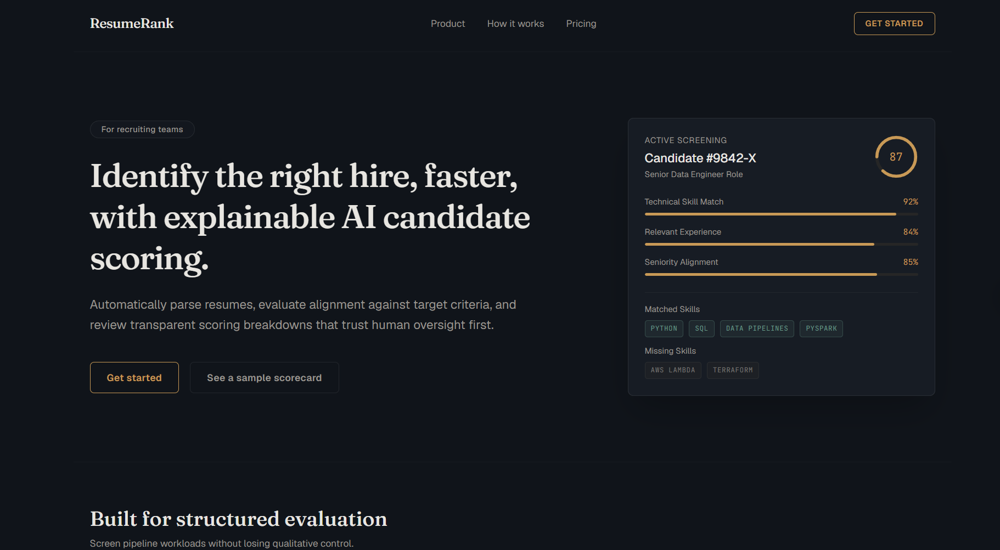
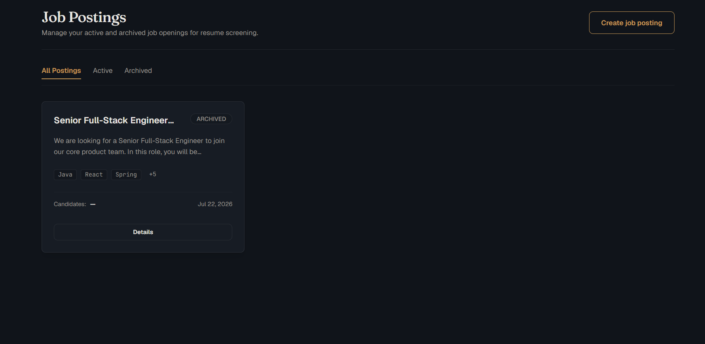
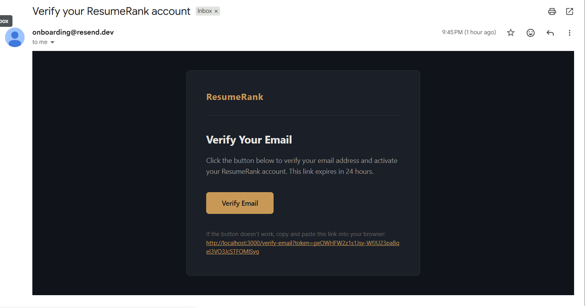
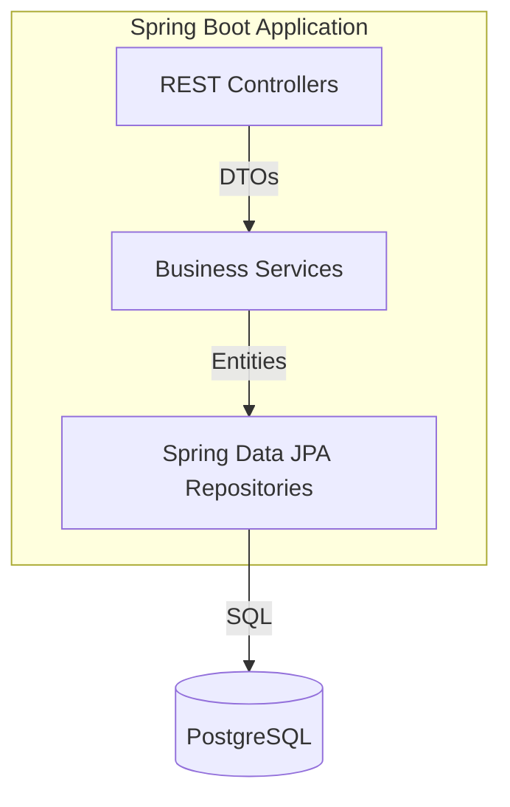
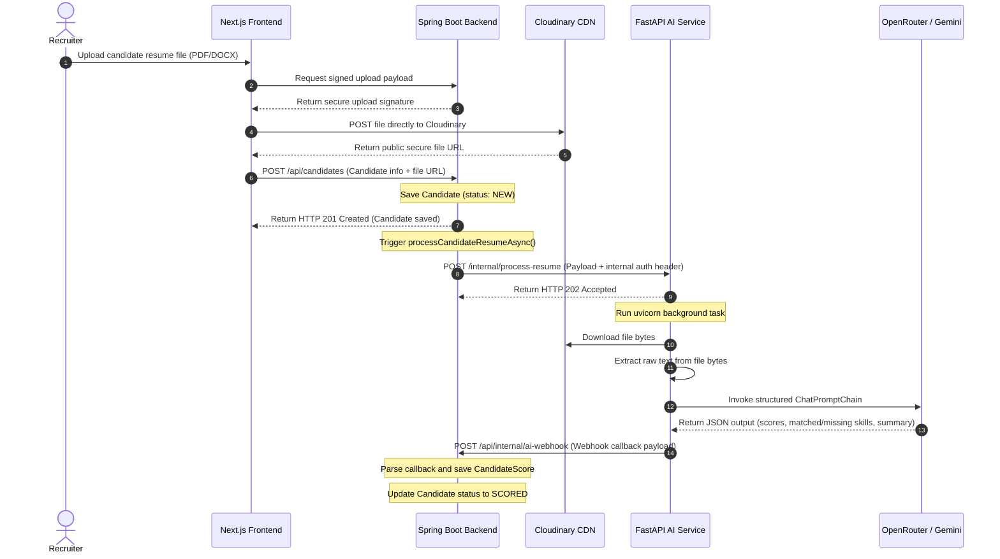
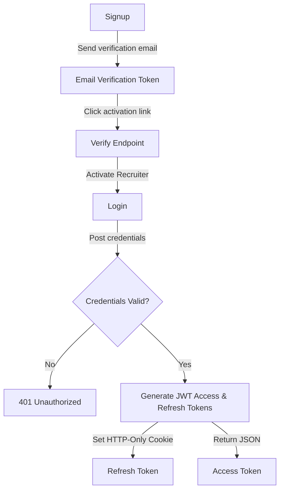
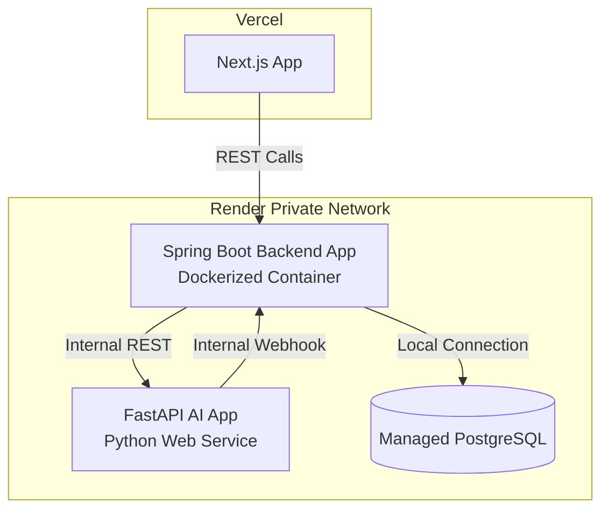

# ResumeRank AI

> An enterprise-grade, multi-service talent acquisition platform powered by LLM-driven resume extraction, scoring, and automated candidate ranking.

[](https://jdk.java.net/21/)
[](https://spring.io/projects/spring-boot)
[](https://nextjs.org/)
[](https://fastapi.tiangolo.com/)
[](https://www.postgresql.org/)
[](https://www.docker.com/)
[](https://github.com/features/actions)
[](https://flywaydb.org/)
[](https://testcontainers.com/)
[](LICENSE)

ResumeRank AI streamlines the hiring process by parsing candidate resumes (PDFs and DOCXs), extracting structured details, comparing them against specific job descriptions, scoring them on key criteria (skills, experience, seniority), and ranking them in a unified recruiter dashboard.

---

## 📸 Screenshots

### Landing Page


### Dashboard


### Candidate Upload & Parsing


### Candidate Scores & Analysis


### Resume Ranking


### Email Verification


---

## 🔗 Demo Links

- **Live Web App**: [https://resume-rank-ai.vercel.app](https://resume-rank-ai.vercel.app)
- **Backend Service URL**: [https://resumerank-ai-zdww.onrender.com](https://resumerank-ai-zdww.onrender.com)
- **API Swagger Documentation**: [https://resumerank-ai-zdww.onrender.com/swagger-ui/index.html](https://resumerank-ai-zdww.onrender.com/swagger-ui/index.html)
- **AI Service OpenAPI Spec**: [https://resumerank-aiservice.onrender.com/docs](https://resumerank-aiservice.onrender.com/docs)
- **Product Demo Video**: [https://vimeo.com/resumerank-ai-demo](https://vimeo.com/resumerank-ai-demo)

---

## 🎯 Project Overview

In high-volume recruitment, reviewing hundreds of resumes manually is slow, error-prone, and biased. Recruiters spend hours scanning documents looking for specific skills, calculating years of experience, and classifying candidates' seniority levels.

**ResumeRank AI** solves this problem by automating the initial screening pipeline:
1. **Recruiters** create a job posting with specific required skills, nice-to-have skills, and target experience.
2. **Candidates** upload their resumes directly (PDF or DOCX format).
3. **The platform** uses custom AI models to automatically parse the files, extract textual data, evaluate skill matching, and grade them on multiple alignment categories.
4. **Candidates are ranked** automatically in real-time on a unified dashboard, enabling recruiters to identify top talent in seconds rather than days.

The platform is designed with a **highly scalable, multi-service, asynchronous microservices architecture** that handles background processing gracefully without locking user sessions.

---

## ✨ Features

### 🔐 Authentication & Security
- **Secure JWT Authentication**: JWT access and refresh token authentication pattern. Refresh tokens are secured via `HttpOnly`, `Secure`, and `SameSite` HTTP cookies to prevent XSS.
- **Email Verification**: Sign-up triggers automated email verification tokens sent via Resend API to validate recruiter email authenticity.
- **Recruiter Account Management**: Secure password hashing via `BCryptPasswordEncoder` and password reset flows with timed verification tokens.
- **Granular Ownership Control**: Access control guards protect REST resources, ensuring users can only manage candidate lists and job postings they own.

### 📄 Resume Management
- **Multi-Format Processing**: Direct upload and text extraction support for standard PDF and DOCX document formats.
- **BFF Proxy Signature Uploads**: Direct client-side uploads to Cloudinary storage via secure signature hashes fetched from the Backend-For-Frontend (BFF) endpoint to save server bandwidth.
- **De-duplication**: MD5 hashing (`resume_hash`) prevents processing duplicate resumes for the same candidate posting, reducing database clutter and API costs.

### 🤖 AI Processing & Scoring
- **Automated Text Extraction**: Python microservice parses PDF/DOCX files and extracts raw text securely.
- **Multi-Category Grading**: Deep scoring based on:
  - **Skills Alignment**: Keyword intersection and conceptual matching of skills.
  - **Experience Alignment**: Years of experience compared to target.
  - **Seniority Alignment**: Seniority classification (Junior, Mid, Senior, Lead).
  - **Overall Score**: Weighted aggregation of the categories.
- **Matched/Missing Skills Discovery**: Extracts which required skills are matched and lists missing requirements.
- **Suitability Summaries**: Generates a concise 1-2 sentence recruiter-facing suitability analysis for each candidate.

### 💼 Job & Candidate Management
- **Target Profiles**: Job postings contain title, description, required skills, nice-to-have skills, target experience, and seniority level.
- **Screening Dashboard**: Recruiters can create, search, filter, and sort candidates on a responsive grid dashboard.
- **Export CSV**: Secure native query CSV exporter handles parsing of native Postgres string arrays to write clean sheets.

### 🛠️ DevOps & Infrastructure
- **Test Separation**: Configured `maven-surefire-plugin` (unit tests) and `maven-failsafe-plugin` (integration tests) to optimize pipeline execution speed.
- **Testcontainers integration**: Runs real PostgreSQL docker instances during integration tests to guarantee 100% database compatibility.
- **Automatic Migration**: Database migrations executed automatically via Flyway during startup and test runs.
- **Dockerized Deployments**: Production-grade multi-stage Docker build configures the backend for Render container hosting.

---

## 💻 Tech Stack

| Layer | Technology | Version | Description |
| :--- | :--- | :--- | :--- |
| **Frontend** | React / Next.js | 15.x | Responsive user interface, App Router, tailwindcss |
| **Backend** | Spring Boot | 3.3.1 | Core API, security, async task execution, entity validation |
| **AI Service** | FastAPI | 0.111.0 | Fast Python processing, document parsing, LLM orchestration |
| **Database** | PostgreSQL | 16 | Relational storage, native arrays (`text[]`) |
| **Migrations** | Flyway | 10 | Strict schema migration control |
| **Security** | Spring Security | 6.x | JWT token auth, CORS filters |
| **Storage** | Cloudinary | - | Blob store for candidate resume uploads |
| **Emails** | Resend | - | Transactional emails (activation, password resets) |
| **DevOps** | Docker | - | Multi-stage image build containerization |
| **CI/CD** | GitHub Actions | - | Automated linting, test run, quality gate check |
| **Testing** | Testcontainers | 1.20 | Spawns clean Postgres Docker containers on integration runs |
| **Libraries** | LangChain / Uvicorn | - | Structured LLM parsing, FastAPI production server

---

## 🏗️ Architecture

### High-Level Service Architecture
The system consists of three independent nodes communicating over secure channels:


### Backend Architecture
Inside the Spring Boot container, requests are handled via standard Layered Architecture pattern:


The services include `CandidateService` (orchestrates resume uploads and processing), `JobPostingService` (manages job details), `AuthService` (controls signup and JWT lifecycle), and `EmailService` (handles transactional emails).

### Asynchronous AI Resume Processing Pipeline
The resume processing workflow is fully asynchronous to prevent thread-blocking on the servlet container:



### Recruiter Authentication Flow


### Production Deployment Architecture


---

## 📂 Folder Structure

```
ResumeRank_AI/
├── .github/
│   └── workflows/
│       ├── backend-ci.yml           # Backend CI (Lint, Test, Coverage, Docker-check)
│       └── quality-gate.yml         # Aggregated branch protection check
├── aiservice/
│   ├── .dockerignore
│   ├── .env.example
│   ├── .gitignore
│   ├── main.py                      # FastAPI microservice entry point & LLM prompt logic
│   ├── requirements.txt             # Python packages (langchain, fastapi, pypdf)
│   └── test_main.py                 # FastAPI routing and extraction unit tests
├── backend/
│   ├── .dockerignore
│   ├── .env.example
│   ├── .gitignore
│   ├── Dockerfile                   # Multi-stage Java 21 production Dockerfile
│   ├── pom.xml                      # Maven configuration (Spring Boot, Testcontainers, JaCoCo)
│   └── src/
│       ├── main/
│       │   ├── java/com/resumerank/backend/
│       │   │   ├── config/              # Security, CORS, Rate Limiting, RestTemplate
│       │   │   ├── controller/          # REST Endpoint Controllers (Job, Candidate, Webhook)
│       │   │   ├── dto/                 # Request & Response Data Transfer Objects
│       │   │   ├── entity/              # JPA Database Models (JSR-380 validation, Postgres Arrays)
│       │   │   ├── exception/           # Exception definitions & Global Handler
│       │   │   ├── repository/          # Spring Data JPA Repository Interfaces
│       │   │   └── service/             # Core Business Logic (Candidate, Job, JWT, Email)
│       │   └── resources/
│       │       ├── db/migration/        # Flyway DB schema migration scripts
│       │       ├── application.yml      # Base Spring Boot Configuration (secured env vars)
│       │       └── templates/           # Thymeleaf verification & reset email templates
│       └── test/
│           ├── java/com/resumerank/backend/
│           │   ├── controller/          # MockMvc Endpoint Integration Tests
│           │   ├── service/             # Unit and mock service tests
│           │   └── support/             # Testcontainers Postgres bootstrap helper base
│           └── resources/
│               └── application-test.yml # Spring active test profile configuration
├── frontend/
│   ├── src/
│   │   ├── app/                     # Next.js App Router Pages and API Route Handlers
│   │   ├── components/              # Shared UI components (tables, inputs, buttons)
│   │   ├── context/                 # AuthContext (recruiter state & JWT refresh timer)
│   │   └── lib/                     # Axios API clients, Cloudinary BFF upload helpers
│   ├── package.json                 # Next.js, tailwindcss dependencies
│   ├── tsconfig.json
│   └── vitest.config.ts             # Vitest frontend suite configurations
└── README.md                        # Project documentation (this file)
```


