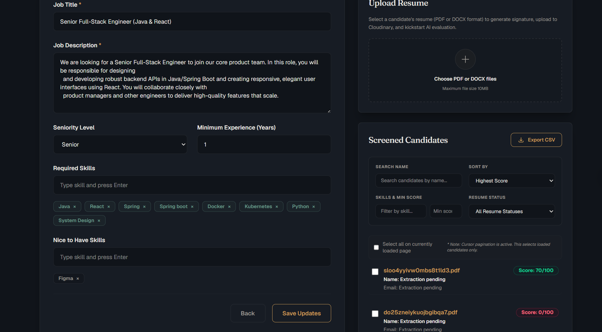
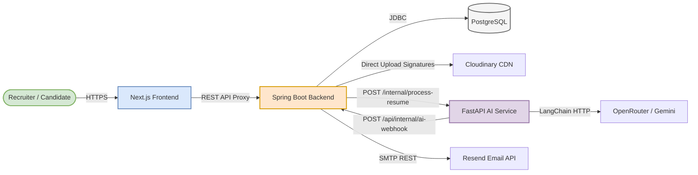
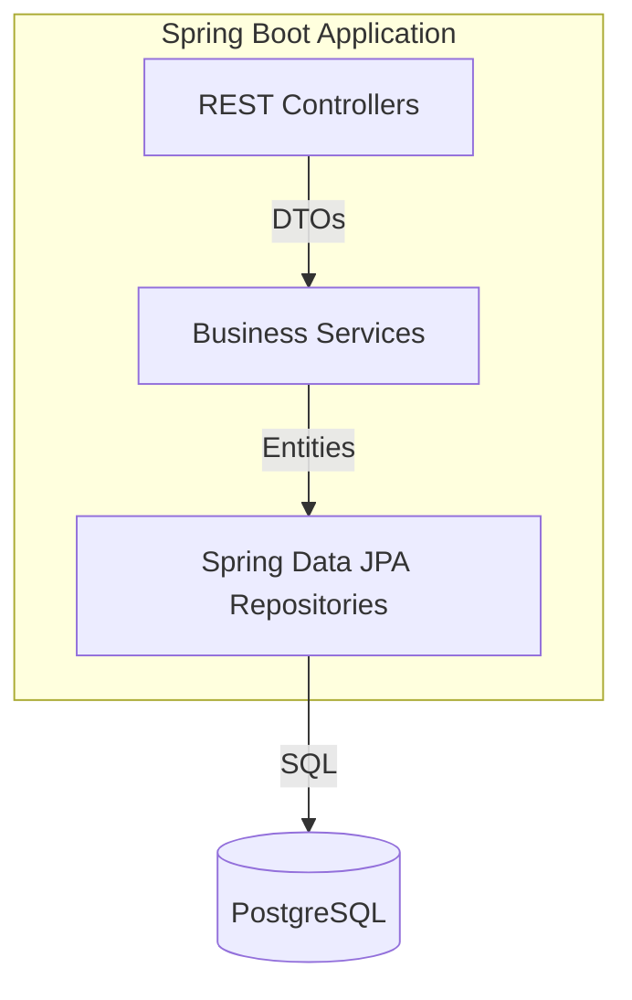
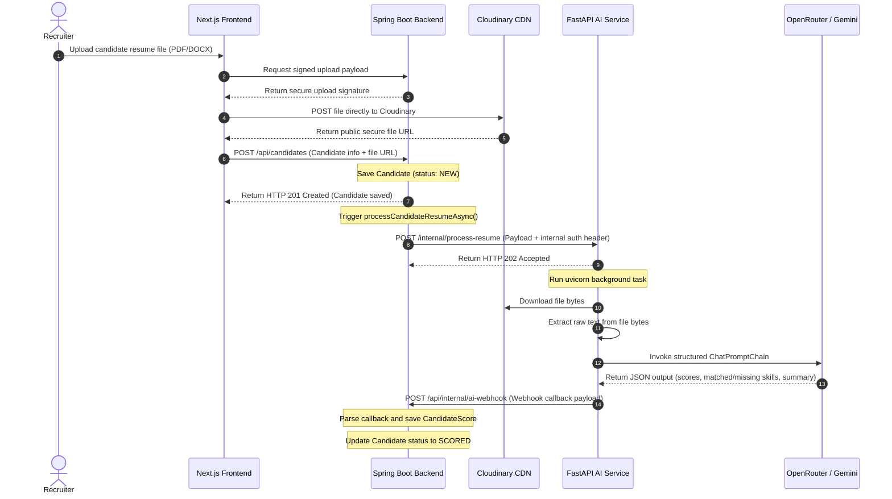
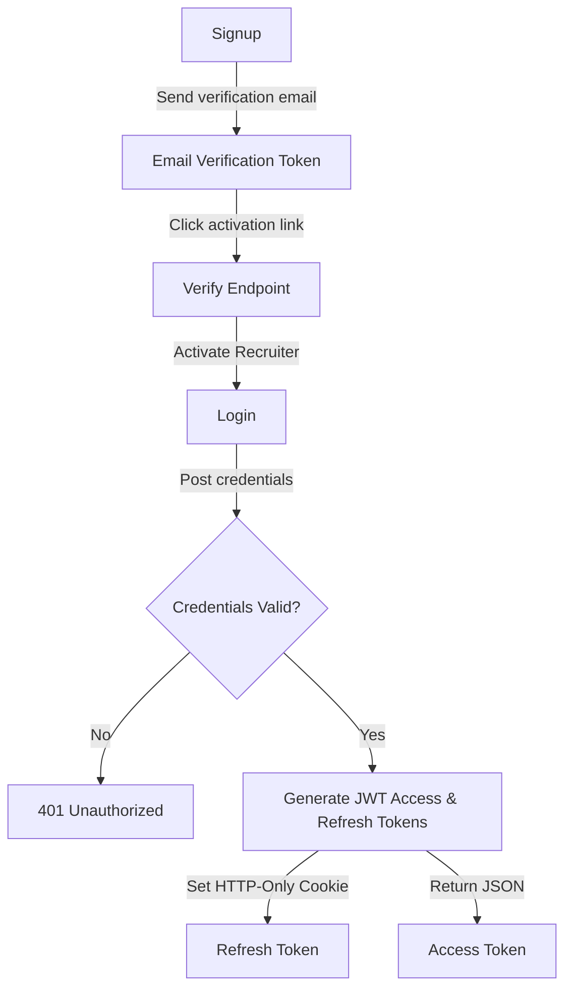
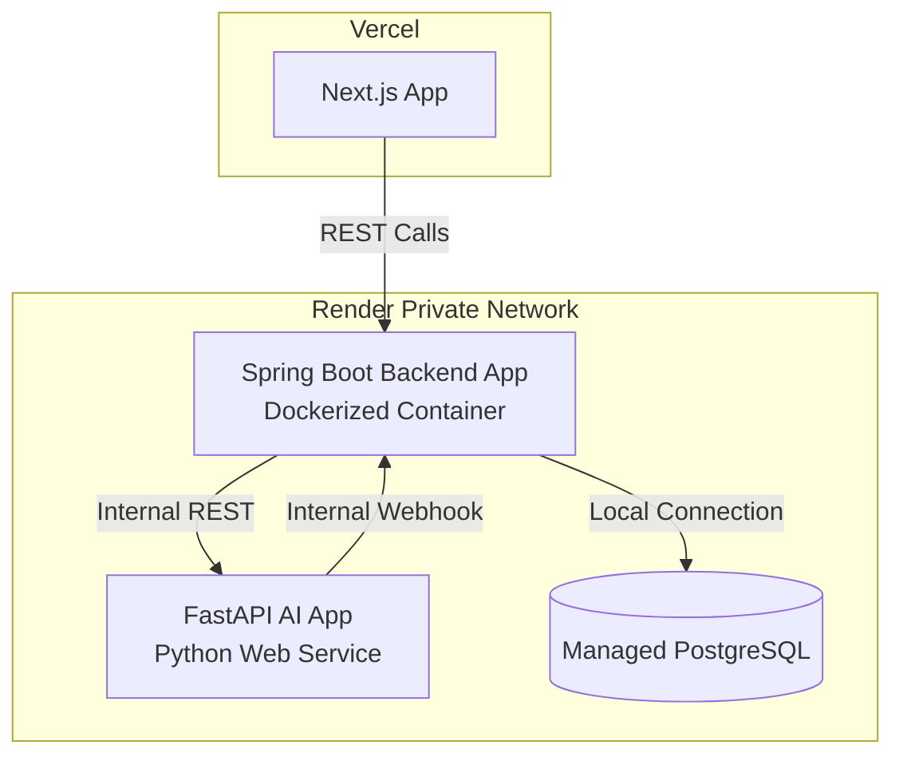
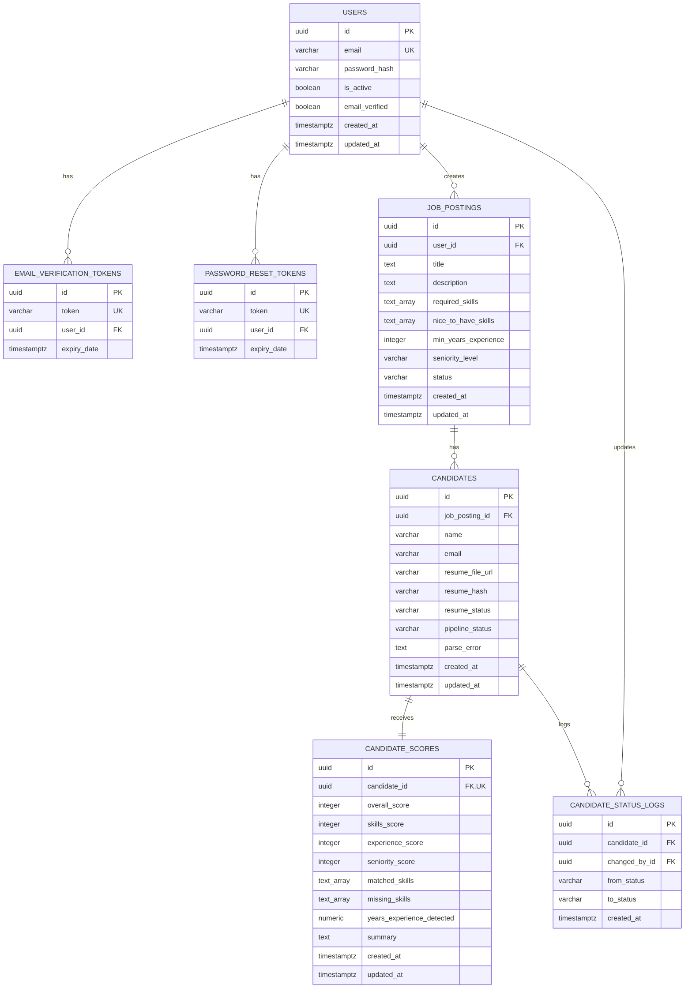

# ResumeRank AI

> An enterprise-grade, multi-service talent acquisition platform powered by LLM-driven resume extraction, scoring, and automated candidate ranking.

[](https://jdk.java.net/21/)
[](https://spring.io/projects/spring-boot)
[](https://nextjs.org/)
[](https://fastapi.tiangolo.com/)
[](https://www.postgresql.org/)
[](https://www.docker.com/)
[](https://github.com/features/actions)
[](https://flywaydb.org/)
[](https://testcontainers.com/)
[](LICENSE)

ResumeRank AI streamlines the hiring process by parsing candidate resumes (PDFs and DOCXs), extracting structured details, comparing them against specific job descriptions, scoring them on key criteria (skills, experience, seniority), and ranking them in a unified recruiter dashboard.

---

## 📸 Screenshots

### Landing Page


### Dashboard


### Parsing Analysis & Resume Ranking


### Email Verification


---

## 🔗 Demo Links

- **Live Web App**: [https://resume-rank-ai.vercel.app](https://resume-rank-ai-iota.vercel.app/)
- **Backend Service URL**: [https://resumerank-ai-zdww.onrender.com](https://resumerank-ai-zdww.onrender.com)
- **API Swagger Documentation**: [https://resumerank-ai-zdww.onrender.com/swagger-ui/index.html](https://resumerank-ai-zdww.onrender.com/swagger-ui/index.html)
- **AI Service OpenAPI Spec**: [https://resumerank-aiservice.onrender.com/docs](https://resumerank-aiservice.onrender.com/docs)
- **Product Demo Video**: [https://vimeo.com/resumerank-ai-demo](https://vimeo.com/resumerank-ai-demo)

---

## 🎯 Project Overview

In high-volume recruitment, reviewing hundreds of resumes manually is slow, error-prone, and biased. Recruiters spend hours scanning documents looking for specific skills, calculating years of experience, and classifying candidates' seniority levels.

**ResumeRank AI** solves this problem by automating the initial screening pipeline:
1. **Recruiters** create a job posting with specific required skills, nice-to-have skills, and target experience.
2. **Candidates** upload their resumes directly (PDF or DOCX format).
3. **The platform** uses custom AI models to automatically parse the files, extract textual data, evaluate skill matching, and grade them on multiple alignment categories.
4. **Candidates are ranked** automatically in real-time on a unified dashboard, enabling recruiters to identify top talent in seconds rather than days.

The platform is designed with a **highly scalable, multi-service, asynchronous microservices architecture** that handles background processing gracefully without locking user sessions.

---

## ✨ Features

### 🔐 Authentication & Security
- **Secure JWT Authentication**: JWT access and refresh token authentication pattern. Refresh tokens are secured via `HttpOnly`, `Secure`, and `SameSite` HTTP cookies to prevent XSS.
- **Email Verification**: Sign-up triggers automated email verification tokens sent via Resend API to validate recruiter email authenticity.
- **Recruiter Account Management**: Secure password hashing via `BCryptPasswordEncoder` and password reset flows with timed verification tokens.
- **Granular Ownership Control**: Access control guards protect REST resources, ensuring users can only manage candidate lists and job postings they own.

### 📄 Resume Management
- **Multi-Format Processing**: Direct upload and text extraction support for standard PDF and DOCX document formats.
- **BFF Proxy Signature Uploads**: Direct client-side uploads to Cloudinary storage via secure signature hashes fetched from the Backend-For-Frontend (BFF) endpoint to save server bandwidth.
- **De-duplication**: MD5 hashing (`resume_hash`) prevents processing duplicate resumes for the same candidate posting, reducing database clutter and API costs.

### 🤖 AI Processing & Scoring
- **Automated Text Extraction**: Python microservice parses PDF/DOCX files and extracts raw text securely.
- **Multi-Category Grading**: Deep scoring based on:
  - **Skills Alignment**: Keyword intersection and conceptual matching of skills.
  - **Experience Alignment**: Years of experience compared to target.
  - **Seniority Alignment**: Seniority classification (Junior, Mid, Senior, Lead).
  - **Overall Score**: Weighted aggregation of the categories.
- **Matched/Missing Skills Discovery**: Extracts which required skills are matched and lists missing requirements.
- **Suitability Summaries**: Generates a concise 1-2 sentence recruiter-facing suitability analysis for each candidate.

### 💼 Job & Candidate Management
- **Target Profiles**: Job postings contain title, description, required skills, nice-to-have skills, target experience, and seniority level.
- **Screening Dashboard**: Recruiters can create, search, filter, and sort candidates on a responsive grid dashboard.
- **Export CSV**: Secure native query CSV exporter handles parsing of native Postgres string arrays to write clean sheets.

### 🛠️ DevOps & Infrastructure
- **Test Separation**: Configured `maven-surefire-plugin` (unit tests) and `maven-failsafe-plugin` (integration tests) to optimize pipeline execution speed.
- **Testcontainers integration**: Runs real PostgreSQL docker instances during integration tests to guarantee 100% database compatibility.
- **Automatic Migration**: Database migrations executed automatically via Flyway during startup and test runs.
- **Dockerized Deployments**: Production-grade multi-stage Docker build configures the backend for Render container hosting.

---

## 💻 Tech Stack

| Layer | Technology | Version | Description |
| :--- | :--- | :--- | :--- |
| **Frontend** | React / Next.js | 15.x | Responsive user interface, App Router, tailwindcss |
| **Backend** | Spring Boot | 3.3.1 | Core API, security, async task execution, entity validation |
| **AI Service** | FastAPI | 0.111.0 | Fast Python processing, document parsing, LLM orchestration |
| **Database** | PostgreSQL | 16 | Relational storage, native arrays (`text[]`) |
| **Migrations** | Flyway | 10 | Strict schema migration control |
| **Security** | Spring Security | 6.x | JWT token auth, CORS filters |
| **Storage** | Cloudinary | - | Blob store for candidate resume uploads |
| **Emails** | Resend | - | Transactional emails (activation, password resets) |
| **DevOps** | Docker | - | Multi-stage image build containerization |
| **CI/CD** | GitHub Actions | - | Automated linting, test run, quality gate check |
| **Testing** | Testcontainers | 1.20 | Spawns clean Postgres Docker containers on integration runs |
| **Libraries** | LangChain / Uvicorn | - | Structured LLM parsing, FastAPI production server

---

## 🏗️ Architecture

### High-Level Service Architecture
The system consists of three independent nodes communicating over secure channels:



### Backend Architecture
Inside the Spring Boot container, requests are handled via standard Layered Architecture pattern:


The services include `CandidateService` (orchestrates resume uploads and processing), `JobPostingService` (manages job details), `AuthService` (controls signup and JWT lifecycle), and `EmailService` (handles transactional emails).

### Asynchronous AI Resume Processing Pipeline
The resume processing workflow is fully asynchronous to prevent thread-blocking on the servlet container:



### Recruiter Authentication Flow


### Production Deployment Architecture


---

## 📂 Folder Structure

```
ResumeRank_AI/
├── .github/
│   └── workflows/
│       ├── backend-ci.yml           # Backend CI (Lint, Test, Coverage, Docker-check)
│       └── quality-gate.yml         # Aggregated branch protection check
├── aiservice/
│   ├── .dockerignore
│   ├── .env.example
│   ├── .gitignore
│   ├── main.py                      # FastAPI microservice entry point & LLM prompt logic
│   ├── requirements.txt             # Python packages (langchain, fastapi, pypdf)
│   └── test_main.py                 # FastAPI routing and extraction unit tests
├── backend/
│   ├── .dockerignore
│   ├── .env.example
│   ├── .gitignore
│   ├── Dockerfile                   # Multi-stage Java 21 production Dockerfile
│   ├── pom.xml                      # Maven configuration (Spring Boot, Testcontainers, JaCoCo)
│   └── src/
│       ├── main/
│       │   ├── java/com/resumerank/backend/
│       │   │   ├── config/              # Security, CORS, Rate Limiting, RestTemplate
│       │   │   ├── controller/          # REST Endpoint Controllers (Job, Candidate, Webhook)
│       │   │   ├── dto/                 # Request & Response Data Transfer Objects
│       │   │   ├── entity/              # JPA Database Models (JSR-380 validation, Postgres Arrays)
│       │   │   ├── exception/           # Exception definitions & Global Handler
│       │   │   ├── repository/          # Spring Data JPA Repository Interfaces
│       │   │   └── service/             # Core Business Logic (Candidate, Job, JWT, Email)
│       │   └── resources/
│       │       ├── db/migration/        # Flyway DB schema migration scripts
│       │       ├── application.yml      # Base Spring Boot Configuration (secured env vars)
│       │       └── templates/           # Thymeleaf verification & reset email templates
│       └── test/
│           ├── java/com/resumerank/backend/
│           │   ├── controller/          # MockMvc Endpoint Integration Tests
│           │   ├── service/             # Unit and mock service tests
│           │   └── support/             # Testcontainers Postgres bootstrap helper base
│           └── resources/
│               └── application-test.yml # Spring active test profile configuration
├── frontend/
│   ├── src/
│   │   ├── app/                     # Next.js App Router Pages and API Route Handlers
│   │   ├── components/              # Shared UI components (tables, inputs, buttons)
│   │   ├── context/                 # AuthContext (recruiter state & JWT refresh timer)
│   │   └── lib/                     # Axios API clients, Cloudinary BFF upload helpers
│   ├── package.json                 # Next.js, tailwindcss dependencies
│   ├── tsconfig.json
│   └── vitest.config.ts             # Vitest frontend suite configurations
└── README.md                        # Project documentation (this file)
```

---

## 🗄️ Database Schema

The database consists of 7 relational tables managed by Flyway. Relational constraints and cascading delete behaviors ensure referential integrity.

### Entity-Relationship Diagram


---

## 🔌 API Reference

### Authentication Endpoints
| HTTP Method | Route | Auth | Description |
| :--- | :--- | :--- | :--- |
| `POST` | `/api/auth/signup` | None | Register a new recruiter account |
| `POST` | `/api/auth/verify-email` | None | Verify recruiter email with verification token |
| `POST` | `/api/auth/login` | None | Authenticate credentials and get JWT access/refresh tokens |
| `POST` | `/api/auth/refresh` | None | Refresh JWT access token using Cookie refresh token |
| `POST` | `/api/auth/reset-password/request` | None | Request password reset verification link |
| `POST` | `/api/auth/reset-password/confirm` | None | Reset password using reset token |

### Job Management Endpoints
| HTTP Method | Route | Auth | Description |
| :--- | :--- | :--- | :--- |
| `POST` | `/api/job-postings` | JWT | Create a new job posting target profile |
| `GET` | `/api/job-postings` | JWT | Get all job postings created by authenticated user |
| `GET` | `/api/job-postings/{id}` | JWT | Get specific job posting details |
| `PUT` | `/api/job-postings/{id}` | JWT | Update job details (title, description, skills) |
| `DELETE` | `/api/job-postings/{id}` | JWT | Delete job posting (cascades delete candidates/scores) |

### Candidate & Resume Endpoints
| HTTP Method | Route | Auth | Description |
| :--- | :--- | :--- | :--- |
| `POST` | `/api/candidates` | JWT | Save a new candidate profile and trigger AI analysis |
| `GET` | `/api/candidates` | JWT | Get candidates associated with a job posting (paginated, sorted, searched) |
| `GET` | `/api/candidates/{id}` | JWT | Get specific candidate and scores details |
| `PUT` | `/api/candidates/{id}/status` | JWT | Update candidate pipeline tracking status |
| `GET` | `/api/candidates/export` | JWT | Export candidates list to a structured CSV file |
| `POST` | `/api/uploads/signature` | JWT | Generate signed token for direct Cloudinary upload |

### Internal Service Endpoints
| HTTP Method | Route | Auth | Description |
| :--- | :--- | :--- | :--- |
| `POST` | `/api/internal/ai-webhook` | Token | Callback endpoint for FastAPI to submit resume scores |

---

## 🤖 AI Service Details

The AI Service is implemented in Python using FastAPI, leveraging LangChain's Structured Output chains to interface with LLMs (e.g. Gemini 2.5 Flash on OpenRouter).

### Python Internal API Route Spec
- **`POST /internal/extract-text`**: Downloads document from `fileUrl`, extracts raw text based on content-type (PDF via `pypdf`, DOCX via `python-docx`), and returns JSON containing raw text content.
- **`POST /internal/process-resume`**: Accepts candidate resume metadata, spins up a background task via FastAPI's `BackgroundTasks` queue, and immediately returns a `202 Accepted` response. The background task extracts the text, scores the resume, and posts the results back to the backend's webhook.
- **`POST /internal/score-resume`**: Raw scoring helper that invokes the LLM chain directly using the defined `SYSTEM_PROMPT` schema constraint.

### API Security & Communication Integrity
FastAPI routes under `/internal/*` are protected using custom dependency middleware that enforces the presence of the **`X-Internal-Token`** header matching the server's `INTERNAL_SERVICE_TOKEN` environment variable.

Similarly, when FastAPI posts results back to Spring Boot's `/api/internal/ai-webhook`, it supplies the `X-Internal-Token` header. The Spring Boot application verifies this token using standard custom filter filters to prevent spoofed score submissions.

---

## 🚀 Installation & Configuration

### Prerequisites
- **Java JDK 21**
- **Maven 3.9+**
- **Python 3.10+ & pip**
- **Node.js 18+ & npm**
- **Docker & Docker Compose**

### Step-by-Step Clone
```bash
git clone https://github.com/Suraj-codes1410/ResumeRank_AI.git
cd ResumeRank_AI
```

---

## 🔑 Environment Variables Reference

### Backend Service (`backend/.env`)
| Variable | Required | Description | Example |
| :--- | :--- | :--- | :--- |
| `SPRING_DATASOURCE_URL` | Yes | PostgreSQL connection JDBC URL | `jdbc:postgresql://localhost:5432/resumerank` |
| `SPRING_DATASOURCE_USERNAME` | Yes | Database username | `postgres` |
| `SPRING_DATASOURCE_PASSWORD` | Yes | Database password | `password` |
| `JWT_SECRET` | Yes | JWT Base64 encoded key (min 256-bit) | `dGhpcy1pcy1hLXN1cGVyLXNlY3JldC...` |
| `CLOUDINARY_CLOUD_NAME` | Yes | Cloudinary account cloud identifier | `my-cloudinary-cloud-name` |
| `CLOUDINARY_API_KEY` | Yes | Cloudinary account API key | `123456789012345` |
| `CLOUDINARY_API_SECRET` | Yes | Cloudinary account API secret | `abcdefghijklmnopqrstuvwxy12` |
| `RESEND_API_KEY` | Yes | Resend API client key | `re_1234567890abcdef` |
| `RESEND_FROM_ADDRESS` | No | Verified Resend email sender | `noreply@resumerank.ai` |
| `FRONTEND_URL` | No | Redirect domain for verification/reset links | `http://localhost:3000` |
| `AI_SERVICE_URL` | No | Base endpoint of FastAPI service | `http://localhost:8000` |
| `INTERNAL_SERVICE_TOKEN` | Yes | Shared token key for internal API auth | `5ec834ec8d0b81d070cde05c9923...` |

### AI Service (`aiservice/.env`)
| Variable | Required | Description | Example |
| :--- | :--- | :--- | :--- |
| `INTERNAL_SERVICE_TOKEN` | Yes | Shared token key for internal API auth | `5ec834ec8d0b81d070cde05c992...` |
| `OPENROUTER_API_KEY` | Yes | OpenRouter API authentication key | `sk-or-v1-abcdef123456...` |
| `OPENROUTER_MODEL` | No | LLM model model name configuration | `google/gemini-2.5-flash` |
| `SPRING_WEBHOOK_URL` | No | Callback URL pointing back to Spring Boot | `http://localhost:8081/api/internal/ai-webhook` |

### Frontend (`frontend/.env.local`)
*(Optional, defaults to proxying via `/api`)*
| Variable | Required | Description | Example |
| :--- | :--- | :--- | :--- |
| `BACKEND_API_URL` | No | Override for backend API URL | `http://localhost:8081` |

---

## 🏃 Running Locally

### 1. Database (Docker Compose)
From the root directory, spawn a clean PostgreSQL instance:
```bash
docker compose up -d db
```

### 2. Backend Service (Spring Boot)
Ensure your `.env` contains correct database connection settings, then run:
```bash
cd backend
mvn spring-boot:run
```
The backend server starts on `http://localhost:8081`.

### 3. AI Service (Python FastAPI)
Navigate to the `aiservice` folder, initialize virtual environment, install dependencies, and launch:
```bash
cd aiservice
python -m venv venv
# On Windows:
.\venv\Scripts\activate
# On Linux/macOS:
source venv/bin/activate

pip install -r requirements.txt
uvicorn main:app --reload --host 0.0.0.0 --port 8000
```
The API Swagger docs are accessible at `http://localhost:8000/docs`.

### 4. Frontend Application (Next.js)
Install Node dependencies and start the development server:
```bash
cd frontend
npm install
npm run dev
```
Open `http://localhost:3000` in your web browser.

---

## 🐳 Docker Deployment

The Spring Boot backend is fully dockerized for hosting platforms like Render that no longer support native Java runtimes.

- **Dockerfile (`backend/Dockerfile`)**: A secure, optimized multi-stage build stage using `maven:3.9.8-eclipse-temurin-21-alpine` to compile and package, copying only the final JRE container layer to `eclipse-temurin:21-jre-alpine` for production execution.
- **Dockerignore (`backend/.dockerignore`)**: Excludes compiler targets, local `.env` files, git configurations, and development IDE configurations to keep build contexts minimal.

### Build and Run Docker Container Locally
```bash
cd backend
docker build -t resumerank-backend .
docker run -p 8081:8081 --env-file .env resumerank-backend
```

---

## 🛠️ CI/CD Pipelines

Automated quality gates are managed via GitHub Actions:

```
Commit Triggered
   │
   ├──► Backend CI Workflow (backend-ci.yml)
   │     ├─── Compile & Checkstyle Lint
   │     ├─── Run Unit Tests (Surefire)
   │     ├─── Run Integration Tests (Failsafe + Testcontainers Postgres)
   │     ├─── Generate Coverage (JaCoCo)
   │     └─── Validate Docker Build Context
   │
   └──► Frontend CI Workflow
         ├─── Install & Lint Check
         └─── Run Vitest suite
```

Branch protections are enforced globally via the `quality-gate.yml` aggregator workflow. Pull Requests require passing all CI checks before code merging is permitted.

---

## 🧪 Testing Strategy

### Unit Tests
- **Backend**: Standard Mockito/JUnit 5 unit tests for services and validators. Run via:
  ```bash
  mvn test
  ```
- **AI Service**: Fast FastAPI HTTP routing unit tests mocking OpenRouter calls. Run via:
  ```bash
  pytest
  ```

### Integration Tests
- **Backend**: Integration tests check controllers and database queries in an integrated Spring Context.
- **Testcontainers & Flyway Integration**: The backend automatically provisions a clean, ephemeral **PostgreSQL Docker container** using Testcontainers. Flyway automatically executes database migrations on this container before the tests run. This guarantees production-matching DB behavior without using mocks. Run via:
  ```bash
  mvn verify
  ```
- **Coverage**: The pipeline compiles code coverage metrics automatically to `target/site/jacoco` during the verify phase.

---

## 🔒 Production Security

1. **Authentication (JWT & Refresh Cookies)**: Short-lived access tokens (JSON output) are sent alongside long-lived refresh tokens (secured HTTP-only cookies) to prevent token theft and session hijack.
2. **Internal API Verification**: Inter-service communication between Spring Boot and FastAPI is secured using matching `X-Internal-Token` validation headers.
3. **Password Security**: All user login passwords are encrypted using strong `BCrypt` hashing.
4. **Environment Variables**: Sensitive tokens, database URLs, and API keys are injected at runtime via environment variables rather than hardcoded in the codebase.

---

## 🚀 Performance Optimizations

- **Asynchronous Task Workers**: Resume scanning and AI parsing are executed in background threads via Spring's `@Async` and FastAPI's `BackgroundTasks`, enabling immediate response times for users.
- **Direct Cloudinary Uploads**: Frontend uploads files directly to Cloudinary using signed signature tokens. This saves server processing bandwidth and avoids massive file transit delays.
- **Connection Pooling**: Uses HikariCP for high-performance database connection pooling.
- **Index-Driven Pagination**: The candidate listing query uses index-backed keyset page pagination to handle huge recruiter candidate lists efficiently.

---

## 🗺️ Roadmap & Future Improvements

- [ ] Support for multiple resumes processing concurrently on user dashboard.
- [ ] Direct export candidate comparison graphs as PDF summaries.
- [ ] Integration with Microsoft Outlook / Google Calendar for automated meeting scheduling.
- [ ] Support for custom weights adjustment on scoring metrics.

---

## 👥 Contributors

- **Suraj** - Lead Engineer & Architect - [GitHub](https://github.com/Suraj-codes1410)

---

## 📄 License

This project is licensed under the MIT License - see the [LICENSE](LICENSE) file for details.


