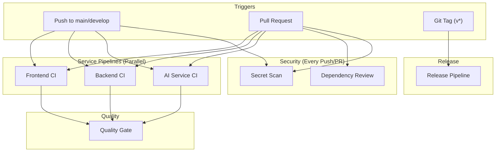
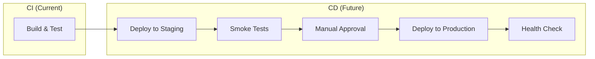

# CI/CD Pipeline Architecture — ResumeRank

> **Last Updated**: July 2026
> **Maintainer**: DevOps Team

---

## Table of Contents

1. [Workflow Architecture](#workflow-architecture)
2. [Pipeline Diagram](#pipeline-diagram)
3. [Trigger Strategy](#trigger-strategy)
4. [Caching Strategy](#caching-strategy)
5. [Quality Gates](#quality-gates)
6. [Security Checks](#security-checks)
7. [Release Strategy](#release-strategy)
8. [Workflow Reference](#workflow-reference)
9. [Optimization Decisions](#optimization-decisions)
10. [Future CD Pipeline](#future-cd-pipeline)
11. [README Badges](#readme-badges)
12. [Enterprise Best Practices](#enterprise-best-practices)

---

## Workflow Architecture

ResumeRank uses a **modular workflow architecture** with 7 independent GitHub Actions workflows. Each service (frontend, backend, AI service) has its own CI pipeline that triggers only when its source files change. Cross-cutting concerns (security, dependencies, quality) run as separate workflows.

```
.github/workflows/
├── frontend-ci.yml        # Next.js 15 build & test pipeline
├── backend-ci.yml         # Spring Boot 3.x build & test pipeline
├── ai-service-ci.yml      # FastAPI build & test pipeline
├── quality-gate.yml       # Aggregated quality validation
├── dependency-review.yml  # Vulnerability & license scanning
├── secret-scan.yml        # Credential leak detection
└── release.yml            # Tag-based release packaging
```

### Why Separate Workflows?

| Concern | Decision |
|---------|----------|
| **Blast radius** | A frontend CSS change never blocks backend deployment |
| **Parallelism** | All 3 service pipelines run concurrently |
| **Maintainability** | Each team owns its pipeline; changes don't require cross-team review |
| **Cost** | Unchanged services don't consume CI minutes |
| **Debugging** | Failures are isolated to the relevant service |

---

## Pipeline Diagram



---

## Trigger Strategy

Each workflow uses **path-based filtering** to only run when relevant source files change.

| Workflow | Trigger Events | Path Filter |
|----------|---------------|-------------|
| Frontend CI | `push`, `pull_request` on `main`/`develop` | `frontend/**` |
| Backend CI | `push`, `pull_request` on `main`/`develop` | `backend/**` |
| AI Service CI | `push`, `pull_request` on `main`/`develop` | `aiservice/**` |
| Quality Gate | `workflow_run` (after CI pipelines), `pull_request` | All paths |
| Dependency Review | `pull_request` | All paths |
| Secret Scan | `push`, `pull_request` | All paths |
| Release | `push` tags matching `v*` | N/A (tag-based) |

### Concurrency Groups

Every workflow uses concurrency groups to **cancel stale builds** when a newer commit is pushed to the same branch:

```yaml
concurrency:
  group: frontend-ci-${{ github.ref }}
  cancel-in-progress: true
```

This prevents wasted CI minutes on outdated commits while preserving release builds (`cancel-in-progress: false` for releases).

---

## Caching Strategy

| Service | Cache Type | Cache Key | Estimated Savings |
|---------|-----------|-----------|-------------------|
| Frontend | npm | `package-lock.json` hash | ~30s per run |
| Backend | Maven | `pom.xml` hash | ~45s per run |
| AI Service | pip | `requirements.txt` hash | ~20s per run |

All caches are managed by GitHub's built-in cache actions (`actions/setup-node`, `actions/setup-java`, `actions/setup-python`) with automatic key invalidation when lock files change.

---

## Quality Gates

The Quality Gate workflow enforces these requirements before any code reaches `main`:

| Check | Enforced By | Threshold |
|-------|-------------|-----------|
| Line coverage | JaCoCo (backend), Vitest (frontend), pytest-cov (AI) | ≥ 80% |
| Lint errors | ESLint, Ruff, Spotless/Checkstyle/PMD | 0 errors |
| Formatting | Prettier, Black | 0 violations |
| Failed tests | Vitest, JUnit 5, Pytest | 0 failures |
| Type errors | TypeScript `tsc`, MyPy | 0 errors |
| Build failures | `next build`, `mvn package`, uvicorn startup | Must succeed |
| Secrets | GitLeaks + custom patterns | 0 findings |
| Vulnerable deps | Dependency Review | No critical/high CVEs |
| License conflicts | Dependency Review | No GPL-3.0/AGPL-3.0 |

### Repository Standards (Enforced Per-Pipeline)

| Standard | Check |
|----------|-------|
| No `.env` files committed | `find . -name '.env'` |
| No `console.log` in production frontend | `grep -rn 'console\.log' src/` |
| No TODO/FIXME in production code | `grep -rn 'TODO\|FIXME'` (warning) |

---

## Security Checks

### Secret Scan (`secret-scan.yml`)

Runs **on every push** using two complementary approaches:

1. **GitLeaks** — Industry-standard tool that scans full git history for 150+ secret patterns
2. **Custom Pattern Scan** — Project-specific patterns for:
   - `OPENROUTER_API_KEY`
   - `RESEND_API_KEY`
   - Cloudinary secrets
   - JWT secrets (`jwt.secret`)
   - Database connection strings (`DATABASE_URL`)
   - `INTERNAL_SERVICE_TOKEN`
   - Private keys (`-----BEGIN.*PRIVATE KEY-----`)
   - OpenAI-style keys (`sk-...`)
   - Resend keys (`re_...`)

### Dependency Review (`dependency-review.yml`)

Runs **on every Pull Request** using GitHub's native dependency review:

- **Fails** on `high` or `critical` severity vulnerabilities
- **Denies** `GPL-3.0` and `AGPL-3.0` licenses (incompatible with commercial use)
- **Comments** a summary in the PR for visibility

---

## Release Strategy

Releases are triggered by **pushing a Git tag** matching the pattern `v*` (e.g., `v1.0.0`, `v1.2.0-rc.1`).

### Release Process

```
git tag v1.0.0
git push origin v1.0.0
```

### What Happens

1. **All three services are built in parallel** (frontend, backend, AI service)
2. **Artifacts are packaged**:
   - `frontend-build-v1.0.0.tar.gz` — Production Next.js bundle
   - `backend-*.jar` — Executable Spring Boot JAR
   - `ai-service-v1.0.0.tar.gz` — FastAPI source archive
3. **SHA256 checksums** are generated for integrity verification
4. **Release notes** are auto-generated from commit history since the previous tag
5. **A GitHub Release** is created with all artifacts attached
6. Pre-release tags (`alpha`, `beta`, `rc`) are automatically flagged

> [!IMPORTANT]
> The release pipeline does **NOT** deploy automatically. Deployment is a separate, manual decision.

---

## Workflow Reference

### Frontend CI — `frontend-ci.yml`

| Job | Purpose | Timeout | Dependencies |
|-----|---------|---------|--------------|
| `lint-and-format` | TypeScript check, ESLint, Prettier | 10 min | — |
| `test` | Vitest with coverage | 15 min | `lint-and-format` |
| `build` | `next build` + artifact upload | 15 min | `test` |
| `repo-standards` | .env, console.log, TODO checks | 5 min | — |

### Backend CI — `backend-ci.yml`

| Job | Purpose | Timeout | Dependencies |
|-----|---------|---------|--------------|
| `compile-and-lint` | Maven compile, Spotless, Checkstyle, PMD | 10 min | — |
| `unit-tests` | `mvn test` with H2 test profile | 15 min | `compile-and-lint` |
| `integration-tests` | `mvn verify` with H2 test profile | 20 min | `unit-tests` |
| `coverage-and-build` | JaCoCo report, JAR packaging | 15 min | `integration-tests` |
| `repo-standards` | .env and TODO checks | 5 min | — |

### AI Service CI — `ai-service-ci.yml`

| Job | Purpose | Timeout | Dependencies |
|-----|---------|---------|--------------|
| `lint-and-format` | Ruff, Black, MyPy | 10 min | — |
| `test` | Pytest with coverage | 15 min | `lint-and-format` |
| `verify-startup` | Confirm uvicorn starts cleanly | 5 min | `test` |
| `repo-standards` | .env and TODO checks | 5 min | — |

---

## Optimization Decisions

| Decision | Rationale |
|----------|-----------|
| **Path-based triggers** | A change to `frontend/` never runs `backend-ci.yml`, saving ~5 min per irrelevant push |
| **Concurrency groups with cancel-in-progress** | Pushing 3 commits rapidly only runs CI on the last one |
| **Sequential job chains within pipelines** | Lint → Test → Build catches errors at the cheapest step first |
| **Parallel service pipelines** | Frontend, Backend, and AI pipelines run simultaneously |
| **Dependency caching everywhere** | npm, Maven, and pip caches reduce install times by 60-80% |
| **Timeout limits on every job** | Prevents hung jobs from consuming unlimited CI minutes |
| **Artifact retention of 7 days** | Balances debugging needs with storage costs |
| **`continue-on-error` for optional linters** | Spotless/Checkstyle/PMD don't block builds if plugins aren't yet configured |

---

## Future CD Pipeline

> [!NOTE]
> The current CI pipeline is **build and test only**. The following CD pipeline should be added when deployment automation is approved.

### Proposed Deployment Architecture



### Recommended CD Additions

| Workflow | Purpose | Trigger |
|----------|---------|---------|
| `deploy-staging.yml` | Deploy to Render/Vercel preview | On merge to `develop` |
| `deploy-production.yml` | Deploy to production | On GitHub Release publish |
| `smoke-tests.yml` | Post-deploy health checks | After each deployment |
| `rollback.yml` | Emergency rollback procedure | Manual dispatch |

### Environment Strategy

| Environment | Branch | Auto-Deploy | Approval |
|-------------|--------|-------------|----------|
| Development | `develop` | Yes | No |
| Staging | `main` | Yes | No |
| Production | Git Tag | No | Required |

---

## README Badges

Add these badges to the top of your `README.md`:

```markdown
[](https://github.com/YOUR_ORG/ResumeRank_AI/actions/workflows/frontend-ci.yml)
[](https://github.com/YOUR_ORG/ResumeRank_AI/actions/workflows/backend-ci.yml)
[](https://github.com/YOUR_ORG/ResumeRank_AI/actions/workflows/ai-service-ci.yml)
[](https://github.com/YOUR_ORG/ResumeRank_AI/actions/workflows/quality-gate.yml)
[](https://github.com/YOUR_ORG/ResumeRank_AI/actions/workflows/secret-scan.yml)
```

> Replace `YOUR_ORG` with your GitHub username or organization name.

---

## Enterprise Best Practices

### Applied in This Pipeline

| Practice | Implementation |
|----------|---------------|
| **Shift-left testing** | Lint and type-check run before tests; tests run before builds |
| **Fail fast** | Cheapest checks (lint) run first; expensive checks (integration tests) run last |
| **Immutable artifacts** | Build once, deploy everywhere — JAR/tarball artifacts are versioned |
| **Secrets-as-code** | All secrets are in GitHub Secrets, never in source; GitLeaks enforces this |
| **Branch protection** | Quality Gate is designed as a required status check |
| **Artifact integrity** | SHA256 checksums generated for every release artifact |
| **Reproducible builds** | Pinned action versions (`@v4`), pinned runtime versions, `npm ci` over `npm install` |
| **Least privilege** | `permissions: contents: read` by default; `write` only for releases |
| **Cost efficiency** | Path filters, concurrency groups, and caching minimize wasted CI minutes |
| **Observable pipelines** | Every job has descriptive names, timeouts, and artifact uploads for debugging |

### Recommended Branch Protection Rules

Configure these in **Settings → Branches → Branch protection rules** for `main`:

- [x] Require a pull request before merging
- [x] Require status checks to pass (add: `Quality Gate / Gate Result`)
- [x] Require branches to be up to date before merging
- [x] Require conversation resolution before merging
- [x] Do not allow bypassing the above settings
